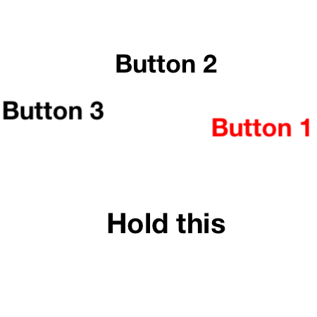

HKRadialMenu
======================

 

(Click on the images to see them in action)

HKRadialMenu contains:
1. An animated menu with an interactive central view that expands other peripherical interactive views.
2. A button that expands other sub-buttons when pushed (à la Prismatic App).

How to use it
-------------

1. Use [CocoaPods](http://www.cocoapods.org) by adding *pod 'HKRadialMenu'* in your Podfile.
2. Manually:
  * Clone this repository
  * Copy HKRadialMenuView, HKRadialMenuViewController, HKRadialMenuItemView, HKRadialMenuButton, HKRadialGestureRecognizer and UIView+Resizing files (.h and .m) into your project.
  * Implement a subclass of "HKRadialMenuViewController" and override the HKRadialMenuViewDataSource and HKRadialMenuViewDelegate protocol methods that you want to customize.
  * HKRadialMenuButton is a just a UIControl

How to configure it
-------------------

### HKRadialMenuView

Just like a UITableView, you need to provide a data source and a delegate to HKRadialMenuView

Data source:

* _- (NSUInteger)numberOfItemsInRadialMenuView:(HKRadialMenuView *)radialMenuView_: returns the number of items (excluding the central one);
* _- (HKRadialMenuItemView *)centerItemViewForRadialMenuView:(HKRadialMenuView *)radialMenuView_: returns the HKRadialMenuItemView (or subclass) that will be used as the central interactive view;
* _- (HKRadialMenuItemView *)itemViewInRadialMenuView:(HKRadialMenuView *)radialMenuView atIndex:(NSUInteger)index_: returns the peripherical view that will be shown at the specified index.

Delegate:

* _- (BOOL)rotateItemInRadialMenuView:(HKRadialMenuView *)radialMenuView atIndex:(NSUInteger)index_: if YES, the view will be viewed with its original rotation (very useful when using labels);
* _- (CGFloat)distanceForItemInRadialMenuView:(HKRadialMenuView *)radialMenuView atIndex:(NSUInteger)index_: returns the radius at which the item will be placed;
* _- (void)radialMenuView:(HKRadialMenuView *)radialMenuView didSelectItemAtIndex:(NSUInteger)index_: called when the user touches an item (except the central one).

Other customizations are available on HKRadialMenuView (also accessible through [HKRadialMenuView appearance]):

* animationDuration: the duration of the expansion animation (in seconds);
* delayBetweenAnimations: the delay between each expansion (in seconds);
* angleRange: the range covered by the peripherical items (default to 0 - 2PI which forms a complete circle).

### HKRadialMenuButton

HKRadialMenuButton is and works like a UIControl. To know what is happening with it just use [UIControl's addTarget:action:forControlEvents: method](http://developer.apple.com/library/ios/documentation/uikit/reference/UIControl_Class/Reference/Reference.html#//apple_ref/occ/instm/UIControl/addTarget:action:forControlEvents:) with UIControlEventValueChanged.
The best way to initialize HKRadialMenuButton is with initWithFrame:andCenterView:andOtherViews:andAngles:.

Read-only properties:

* backgroundView: The background view, use it to customize the control's background.
* contentView: The view that contains all the user-provided subviews.
* isExpanded: indicates whether the radial views are expanded or not.
* selectedIndex: this is the most important property, it indicates the index of the subview that provoked the UIControlEventValueChanged event. Can also be _HKRadialMenuButtonCenterIndex_ (-1) which is the main (and always visible) view.

Appearance properties (also accessible through [HKRadialMenuButton appearance]):

* expansionDelay: time (in seconds) before the peripherical buttons start showing. Default value is 0.5.
* autoRotate: if YES, the view will be viewed with its original rotation (very useful when using labels). Default value is YES.
* animationDuration: the duration of the expansion animation. The selection (grow and fade) animation is (animationDuration / 2). Default value is 0.5.
* magnetismRatio: When a radial view becomes the active (and selectable) one, it moves slightly towards the center view at (magnetismRatio * distanceBetweenTheViews). Default value is 0.95.

HKRadialMenuButton can also have a delegate (with the _HKRadialMenuButtonDelegate_ protocol):

* _radialMenuButton:highlightedView:atIndex:_ : is called when a view becomes the active one.
* _radialMenuButton:unhighlightedView:atIndex:_ : is called when a view loses its active state.
