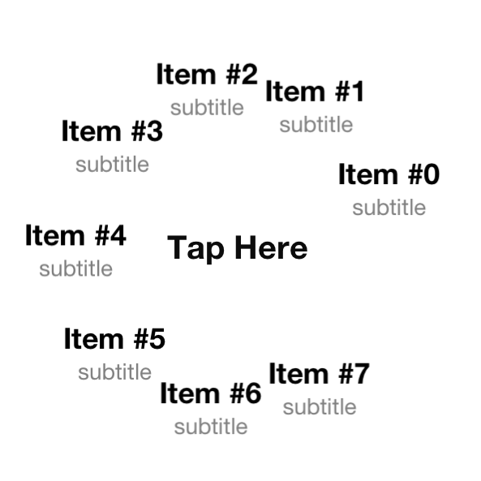

HKRadialMenu
======================

HKRadialMenu is an animated menu with an interactive central view that expands other peripherical interactive views.

How to use it
-------------

1. Use [CocoaPods](http://www.cocoapods.org) by adding *pod 'HKRadilaMenu'* in your Podfile.
2. Manually:
  * Clone this repository
  * Copy HKRadialMenuView, HKRadialMenuViewController, HKRadialMenuItemView and UIView+Resizing files (.h and .m) into your project.
  * The easiest way is to use "HKRadialMenuViewController" and override the HKRadialMenuViewDataSource and HKRadialMenuViewDelegate protocol methods that you want to customize.

How to configure it
-------------------

Just like a UITableView, you need to provide a data source and a delegate to HKRadialMenuView

Data source:

* -(NSUInteger)numberOfItemsInRadialMenuView:(HKRadialMenuView *)radialMenuView: returns the number of items (excluding the central one);
* -(HKRadialMenuItemView *)centerItemViewForRadialMenuView:(HKRadialMenuView *)radialMenuView: returns the HKRadialMenuItemView (or subclass) that will be used as the central interactive view;
* - (HKRadialMenuItemView *)itemViewInRadialMenuView:(HKRadialMenuView *)radialMenuView atIndex:(NSUInteger)index: returns the peripherical view that will be shown at the specified index.

Delegate:

* - (BOOL)rotateItemInRadialMenuView:(HKRadialMenuView *)radialMenuView atIndex:(NSUInteger)index: if YES, the view will be viewed with its original rotation (very useful when using labels);
* - (CGFloat)distanceForItemInRadialMenuView:(HKRadialMenuView *)radialMenuView atIndex:(NSUInteger)index: returns the radius at which the item will be placed;
* - (void)radialMenuView:(HKRadialMenuView *)radialMenuView didSelectItemAtIndex:(NSUInteger)index: called when the user touches an item (except the central one).

Other customizations are available on HKRadialMenuView (also accessible through [HKRadialMenuView appearance]):

* animationDuration: the duration of the expansion animation (in seconds);
* delayBetweenAnimations: the delay between each expansion (in seconds);
* angleRange: the range covered by the peripherical items (default to 0 - 2PI which forms a complete circle).
